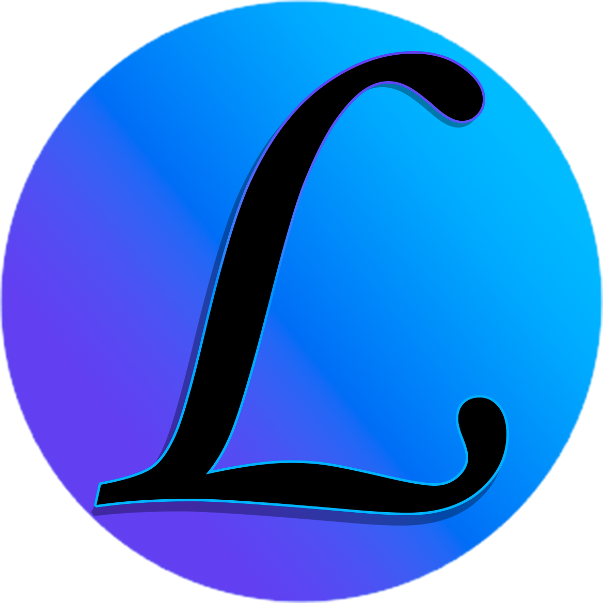

<!-- Improved compatibility of back to top link: See: https://github.com/othneildrew/Best-README-Template/pull/73 -->

<!--
*** Thanks for checking out the Best-README-Template. If you have a suggestion
*** that would make this better, please fork the repo and create a pull request
*** or simply open an issue with the tag "enhancement".
*** Don't forget to give the project a star!
*** Thanks again! Now go create something AMAZING! :D
*** From me: I don't delete comments on purpose so that the author is pleased that his project template is being used :)
-->
[![Forks][forks-shield]][forks-url]
[![Stargazers][stars-shield]][stars-url]
[![Issues][issues-shield]][issues-url]
[![Watch][Watch-shield]][Watch-url]
[![License][license-shield]][license-url]

<!-- PROJECT LOGO -->
 

  

  <h3 align="center"The "Launcher" Project</h3>

  

   A wonderful launcher for your project!
     
     
    <a href="https://github.com/VarionDrakon/LauncherGame/issues">Report Bug</a>
    ·
    <a href="https://github.com/VarionDrakon/LauncherGame/issues">Request Feature</a>
  

<!-- TABLE OF CONTENTS -->

  
Table of Contents

  <ol>
    <li>
      <a href="#about-the-project">About The Project</a>
      <ul>
        <li><a href="#built-with">Built With</a></li>
      </ul>
    </li>
    <li>
      <a href="#getting-started">Getting Started</a>
    </li>
    <li><a href="#usage">Usage</a></li>
    <li><a href="#roadmap">Roadmap</a></li>
    <li><a href="#contributing">Contributing</a></li>
    <li><a href="#license">License</a></li>
    <li><a href="#contact">Contact</a></li>
  </ol>

<!-- ABOUT THE PROJECT -->
## About The Project

  

This project is being developed as part of amateur entertainment with WPF and improving their skills in developing software with an interface, this project does not pretend to be more serious development due to the code specification and not quite normal cross-platform C#. At the moment, the project is at the penultimate stage of development, after which the project will switch to the "Support" state. At the moment, the application can...

Here's what:
* Check the connection with the remote server.
* Check for a new version on the server.
* Download and automatically install a new application that you will distribute through the launcher.
* Check for an already installed version (BETA).
* Launching and tracking the process of a running game/program.

At the moment, the project has NO documentation because it has a simple syntax, but in the future the documentation will DEFINITELY be written :)

(<a href="#readme-top">back to top</a>)

### Built With

This section list any major frameworks/libraries used to bootstrap project.

* [![VusialStudio2022][VusialStudio2022]][VusialStudio2022-url]
* [![CSharp][CSharp]][CSharp-url]

(<a href="#readme-top">back to top</a>)

<!-- GETTING STARTED -->
## Getting Started

Download the project from the <a href="https://github.com/VarionDrakon/LauncherGame/tree/main/SourceCode">Source Code</a> folder and unpack it to any place convenient for you. You can immediately start studying the terrible code and development in the future. You can start :)

(<a href="#readme-top">back to top</a>)

<!-- USAGE EXAMPLES -->
## Usage
There is no documentation, but you are holding on.

  

(<a href="#readme-top">back to top</a>)

<!-- ROADMAP -->
## Roadmap

- [x] Communication with the server
- [x] Checking the version
- [x] Downloading the update archive
- [x] Unpacking the update archive
- [x] Launching and tracking the process of a running game/program
    - [x] Tracking
    - [x] Forced closure of the process
- [x] Informative content
- [-] (BETA) Creating logs while working (Dropped)
- [x] Startup Argument Settings
- [x] Speed control of the launcher
- [-] Support for multiple programs (Dropped)
- [-] authorization in the launcher (Dropped)
- [x] the final elimination of bugs and release into release with subsequent "support".

The map is approximate and may change during development*

(<a href="#readme-top">back to top</a>)

<!-- CONTRIBUTING -->
## Contributing

Contributions are what make the open source community such an amazing place to learn, inspire, and create. Any contributions you make are **greatly appreciated**

If you have a suggestion that would make this better, please fork the repo and create a pull request. You can also simply open an issue with the tag "enhancement".

1. Fork the Project
2. Create your Feature Branch (`git checkout -b feature/AmazingFeature`)
3. Commit your Changes (`git commit -m 'Add some AmazingFeature'`)
4. Push to the Branch (`git push origin feature/AmazingFeature`)
5. Open a Pull Request

(<a href="#readme-top">back to top</a>)

<!-- LICENSE -->
## License

Distributed under the License. See `LICENSE.txt` for more information.

(<a href="#readme-top">back to top</a>)

<!-- CONTACT -->
## Contact

My name and firstname:
Varion Drakonov (VarionDrakon (Abbreviated)) 

Project Link: 
[https://github.com/VarionDrakon/LauncherGame](https://github.com/VarionDrakon/LauncherGame)

My YouTube channel: 

 Subscibe ^^

Links to my social networks for communication:

* [![VK][VK]][VK-url]
* [![Facebook][Facebook]][Facebook-url]
* [![Telegram][Telegram]][Telegram-url]
* [![Twitter][Twitter]][Twitter-url]
* [![OK][OK]][OK-url]
* [![Instagramm][Instagramm]][Instagramm-url]
* [![RUTube][RUTube]][RUTube-url]
* [![Microsoft][Microsoft]][Microsoft-url]

(<a href="#readme-top">back to top</a>)

[forks-shield]: https://img.shields.io/github/forks/VarionDrakon/LauncherGame?style=for-the-badge
[forks-url]: https://github.com/VarionDrakon/LauncherGame/network/members

[stars-shield]: https://img.shields.io/github/stars/VarionDrakon/LauncherGame?style=for-the-badge 
[stars-url]: https://github.com/VarionDrakon/LauncherGame/stargazers

[Watch-shield]: https://img.shields.io/github/watchers/VarionDrakon/LauncherGame?style=for-the-badge
[Watch-url]: https://github.com/VarionDrakon/LauncherGame/watchers

[issues-shield]: https://img.shields.io/github/issues-raw/VarionDrakon/LauncherGame?style=for-the-badge
[issues-url]: https://github.com/VarionDrakon/LauncherGame?/issues

[license-shield]: https://img.shields.io/github/license/VarionDrakon/LauncherGame?style=for-the-badge 
[license-url]: https://github.com/VarionDrakon/LauncherGame/blob/main/LICENSE

[VusialStudio2022]: https://img.shields.io/badge/Visual%20Studio%202022-800080?style=for-the-badge&logo=visualstudio&logoColor=white
[VusialStudio2022-url]: https://visualstudio.microsoft.com/en/vs/community/

[CSharp]: https://img.shields.io/badge/.NET%20Framework%204.7.2-800080?style=for-the-badge&logo=dotnet&logoColor=white
[CSharp-url]: https://dotnet.microsoft.com/en-us/download/dotnet-framework/net472

[VK]: https://img.shields.io/badge/VK-4C75A3?style=for-the-badge&logo=vk&logoColor=white
[VK-url]: https://vk.com/varion.drakonov

[RUTube]: https://img.shields.io/badge/RUTube-00001a?style=for-the-badge&logo=PeerTube&logoColor=white
[RUTube-url]: https://rutube.ru/channel/28612463/

[Instagramm]: https://img.shields.io/badge/Instagramm-C13584?style=for-the-badge&logo=Instagram&logoColor=white
[Instagramm-url]: https://www.instagram.com/varion.drakonov

[Telegram]: https://img.shields.io/badge/Telegram-27A7E7?style=for-the-badge&logo=Telegram&logoColor=white
[Telegram-url]: https://t.me/VarionDrakon

[Facebook]: https://img.shields.io/badge/Facebook-3b5998?style=for-the-badge&logo=Facebook&logoColor=white
[Facebook-url]: https://web.facebook.com/varion.drakonov

[OK]: https://img.shields.io/badge/OkRu-ed812b?style=for-the-badge&logo=Odnoklassniki&logoColor=white
[OK-url]: https://ok.ru/varion.drakon

[Twitter]: https://img.shields.io/badge/Twitter-1D9BF0?style=for-the-badge&logo=Twitter&logoColor=white
[Twitter-url]: https://twitter.com/varion_drakonov

[Microsoft]: https://img.shields.io/badge/Microsoft-737373?style=for-the-badge&logo=Microsoft&logoColor=white
[Microsoft-url]: https://learn.microsoft.com/en-us/users/variondrakonov/
